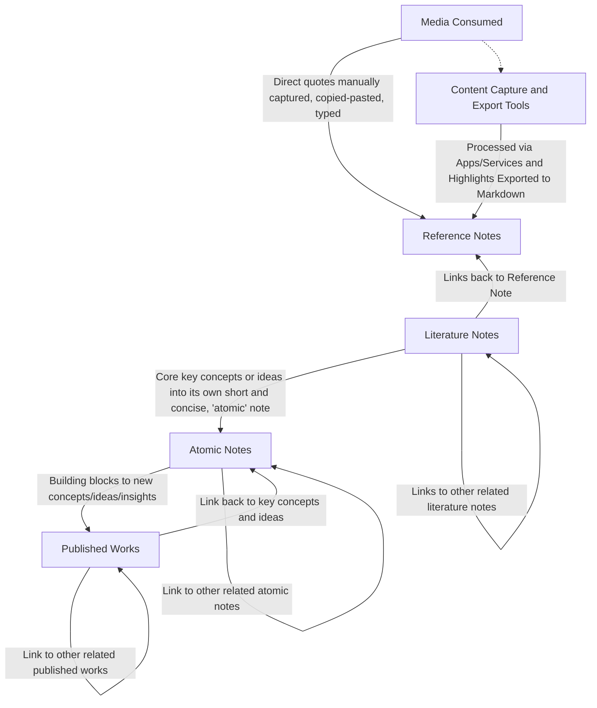

# Obsidian Zettelkasten Workflow

Knock-knock housekeeping: [[README]]

Create new note then apply the corresponding template

1. **[[Reference Note#Reference Note]]:** media consumed and observations around you are highlighted and captured in this note
   - Anything that resonates with you is captured by you typing verbatim the direct quotes, passages, soundbites, or excerpts
   - The process can be made easier via apps and services like [Instapaper](https://www.instapaper.com/), [Obsidian Web Clipper](https://obsidian.md/clipper), [Readwise's Reader app](https://readwise.io/read), and [Zotero](https://www.zotero.org/)
     - Most popular apps have Obsidian plug-ins that will then export the highlights made and initial notes into Markdown to be saved in your [Obsidian vault](https://help.obsidian.md/Getting+started/Create+a+vault)
1. **[[Literature Notes]]:** these notes is where you, in your own words, further expand on your interpretation of the original concept, idea, or quote captured in your **_[[Reference Note#Reference Note]]_**
   - There may be times you'll have more highlights than you have elaborated in your **_[[Literature Notes]]_**
   - This is fine for you are to summarize the main points, so to easily and quickly comprehend what the source material is about
1. **[[Atomic Notes]]:** These notes are meant to be "atomic", above the fold, short and concise encapsulations of concepts and ideas (i.e. extracted essential concepts and ideas) from one or more **_[[Literature Notes]]_**
   - Although these ideas and concepts are obtained from their respective **_[[Literature Notes]]_** (by extension their sources) the concepts and ideas are written in your own words, written independent from their original context, and targeted for an wide audience who are new to or ignorant to the concept or idea
   - These notes are the building blocks to writing **_[[Literature Notes]]_**
1. **[[Published Works]]:** is your creative outlet to demonstrate and present your time spent reading and watching videos, understanding of concepts, and ideas you've had into an academic journal, article, blog, book, YouTube video, etc.
2. [[Daily Note]]: is a daily log and place holder of quick notes and observations
