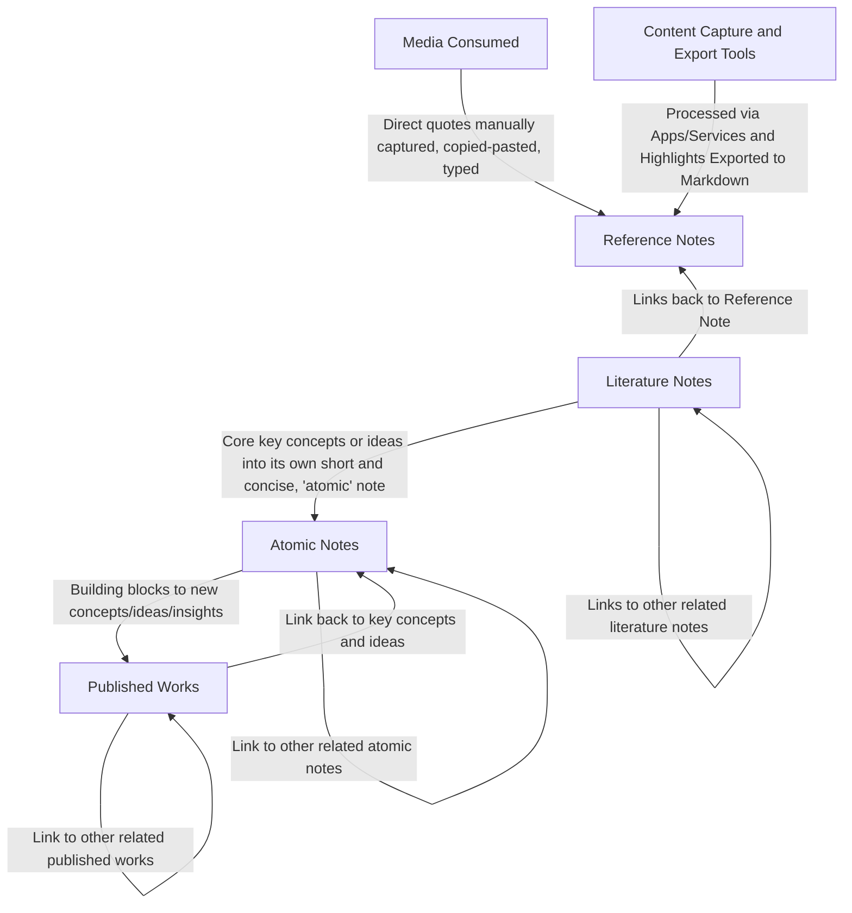

# Obsidian Zettelkasten Workflow

Create new note then apply the corresponding template

1. **[[#Reference Note]]:** media consumed and observations around you are highlighted and captured in this note
   - Anything that resonates with you is captured by you typing verbatim the direct quotes, passages, soundbites, or excerpts
   - The process can be made easier via apps and services like [Instapaper](https://www.instapaper.com/), [Obsidian Web Clipper](https://obsidian.md/clipper), [Readwise's Reader app](https://readwise.io/read), and [Zotero](https://www.zotero.org/)
     - Most popular apps have Obsidian plug-ins that will then export the highlights made and initial notes into Markdown to be saved in your [Obsidian vault](https://help.obsidian.md/Getting+started/Create+a+vault)
1. **[[#Literature Notes]]:** these notes is where you, in your own words, further expand on your interpretation of the original concept, idea, or quote captured in your **_[[#Reference Note]]_**
   - There may be times you'll have more highlights than you have elaborated in your **_[[#Literature Notes]]_**
   - This is fine for you are to summarize the main points, so to easily and quickly comprehend what the source material is about
1. **[[#Atomic Notes]]:** These notes are meant to be "atomic", above the fold, short and concise encapsulations of concepts and ideas (i.e. extracted essential concepts and ideas) from one or more **_[[#Literature Notes]]_**
   - Although these ideas and concepts are obtained from their respective **_[[#Literature Notes]]_** (by extension their sources) the concepts and ideas are written in your own words, written independent from their original context, and targeted for an wide audience who are new to or ignorant to the concept or idea
   - These notes are the building blocks to writing **_[[#Literature Notes]]_**
1. **[[#Published Works]]:** is your creative outlet to demonstrate and present your time spent reading and watching videos, understanding of concepts, and ideas you've had into an academic journal, article, blog, book, YouTube video, etc.

## Daily Note

Note template: [[Daily Note]]

- **File naming convention:** `YYYY-MM-DD`
- **Does not link to:** any note, for this is just a note to jot fleeting notes, capture quick ideas or tasks. This is in leu of apps like [Todoist](https://todoist.com/) and [TickTick](https://ticktick.com/?language=en_us).

**Purpose:** Daily notes is a top-to-bottom, linear, journal and log entries of tasks you've done, a quick thought you'd want to make note of, or a quick capture of how you were felt through-out the day. Typically all items are noted via bullet points and not as carefully drafted pros.

- Key observations for the day.
- Idea: Brainstorm or note any creative ideas.
- [ ] Task01

## Reference Note

Note Templates: [[Reference Note]], [[Meeting Note]]

- **Proposed file naming convention:** Author's last name - source title
- **Does not link to:** any note, for you'd want the summaries of your reference notes (AKA your literature notes) to drive your personal insight and perspectives (as _literature notes_ were written in your own words and came from your insights, interpretations, and perspectives)

**Purpose:** It's recommended that you have a reference management software integration that you can save as markdown. Otherwise it's the raw capture, in the moment, of the medium you're consuming anything from article, book, podcast, poem, video and even a conversation, a lecture, or a meeting. This note captures un-doctored direct quotes, extrapolated data results, source concept and ideas, and the alike.

Content Capture and Export, or Information Management Tools like:

- [Instapaper](https://www.instapaper.com/)
- [Obsidian Web Clipper](https://obsidian.md/clipper)
- [Readwise's Reader app](https://readwise.io/read)
- [Zotero](https://www.zotero.org/)

### Create Unique Note

The `Create New Unique Note` setting is enabled and is defaulted to use the [[Meeting Note]] template. New, Zettelkasten styled, unique notes are meant to serve as "OMG, I'm meeting with someone right now and I need a new note to capture what we've discussed". After the meeting one is then free to rename the title of the note and fill in miscellaneous details (e.g. attendees of the meeting).

## Literature Notes

Note templates: [[Literature Note]], [[Meeting Summary Note]]

- **Proposed File naming convention:** Author's last name - source title
- **Links to:** other literature notes and to atomic notes
- **Does not link to:** daily notes or reference notes

This note links back to the reference note, link to other related literature notes, and link to other atomic notes.

**Purpose:** This is your high level summary written in your own words. These notes are your own interpretation of the thoughts, ideas, and concepts highlighted in your reference notes captured/copied from the source material you've consumed (i.e. article, book, conversation, meeting, podcast, poem, video, etc.). You get to pick and choose what highlights to reference and further make note of and expand upon. Not all highlights from the reference note is needed to illustrate the overall summary.

## Atomic Notes

Note template: [[Atomic Note]]

- **Proposed File naming convention:**
  - The key concept or idea
  - A question: who, what, when, where, why, or how - be sure to use aliases too to remove the question part of said key figure, object, location, situation, etc.
- **Links to:** other atomic notes and published works
- **Does not link to:** daily notes or reference notes

This not does not link back to literature notes. Links to other related atomic notes.

**Purpose:** The note is short and concise, is made to be "atomic", as much as possible (i.e. the content should be above the fold: you should not have to scroll to gain understanding). It should be relatively easy to understand by anyone ignorant of the field, topic, domain, and/or original context. Also referred or known as "permanent notes" or "evergreen notes". I've chosen "atomic notes" for it better describes what the note should be... Calling it "permanent" is a little presumptuous.

Components of a good quality atomic note are:

1. The note is atomic: the note encapsulates 1 and only 1 idea or concept.
2. The note is short and concise as much as possible (i.e. the content should be above the fold: you should not have to scroll to gain understanding). It should be relatively easy to understand by anyone ignorant of the field, topic, domain, and/or original context.
3. The atomic note, via [Wikilink](https://help.obsidian.md/web-clipper/filters#%60wikilink%60): `[[Multi-tasking myth]]` or [Markdown link](https://help.obsidian.md/Linking+notes+and+files/Internal+links#Supported+formats+for+internal+links): `[Multi-tasking myth](Multi-tasking myth)`, internally links out to at least one (or more) atomic note.

## Published Works

- **Links to:** the atomic notes that contributed to the finished published work
- **Does not link to:** daily notes or reference notes

Published works link back to the atomic notes that contributed to the finish published work.

**Purpose:** to make use of and leverage all of your time, effort, learning, and knowledge gained to share with the world (or just a few family and friends). This is your opportunity to make an impact and share your perspectives and insights. The published work is your created project to produce work that is shareable via a link. Think blogs, a public journal, YouTube, etc. If the content is not a blog to be published then it can house an outline or a script for a video, a manuscript, a podcast script, a song, a piece of code, or anything else you can imagine.
